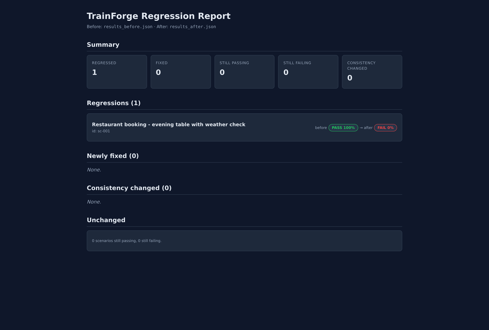

# CLI reference

The `trainforge` console script ships with five subcommands.

| Command | What it does |
|---|---|
| [`run`](#trainforge-run) | Execute scenarios against an agent (HTTP or in-process). |
| [`record`](#trainforge-record) | REPL: chat with your agent, write a scenario file. |
| [`report`](#trainforge-report) | Render a static HTML report from a results file. |
| [`diff`](#trainforge-diff) | Compare two results files and produce a regression report. |
| [`mock-agent`](#trainforge-mock-agent) | Serve a fake agent for development / runner self-tests. |

## `trainforge run`

Execute scenarios against an agent.

```bash
trainforge run \
  --scenarios scenarios.json \
  --agent module:callable \
  --output results.json
```

| Flag | Required | Default | Description |
|---|---|---|---|
| `--scenarios PATH` | yes | — | Path to one scenarios JSON file. |
| `--agent SPEC` | one of `--agent` or `--agent-url` | — | In-process agent: `module:callable` (uvicorn-style) or `module:factory()`. |
| `--agent-url URL` | one of `--agent` or `--agent-url` | — | HTTP POST endpoint of the agent under test. |
| `--output PATH` | yes | — | Where to write `results.json`. |
| `--llm-api-url URL` | conditional | `$OPENAI_API_URL` | OpenAI-compatible endpoint for the judge LLM. Only required if any scenario uses `may_diverge: true`, has custom turn `checks`, or has non-empty `outcome_checks`. |
| `--llm-api-key KEY` | conditional | `$OPENAI_API_KEY` | API key for the judge LLM. Same condition as above. |
| `--llm-model NAME` | optional | `gpt-4o-mini` | Judge LLM model id. |
| `--override-model NAME` | optional | — | Sets `TRAINFORGE_OVERRIDE_MODEL` env var + ContextVar for this run. See [Hot-swap](getting-started.md#hot-swap-ab-prompt-and-model-changes). |
| `--override-prompt PATH` | optional | — | Reads PATH, sets contents as `TRAINFORGE_OVERRIDE_PROMPT`. |
| `--runs N` | optional | `1` | Number of times to run each scenario. >1 enables consistency scoring. |
| `--timeout SECONDS` | optional | `30` | Per-request agent timeout. |
| `--parallel N` | optional | `1` | Run up to N scenarios concurrently via `asyncio.gather`. |

Exits non-zero if any scenarios fail or the agent is unreachable.

### Lazy LLM behavior

When no LLM credentials are configured, `trainforge run` constructs a
stub that raises only when the judge is actually invoked. Deterministic
scenarios (no `may_diverge: true`, no per-turn custom checks, no
`outcome_checks`) run to completion without an LLM key.

## `trainforge record`

Capture mode: REPL-driven scenario generation from a live in-process
agent.

```bash
trainforge record \
  --agent my_module:run \
  --output scenarios/draft.json
```

| Flag | Required | Default | Description |
|---|---|---|---|
| `--agent SPEC` | yes | — | In-process agent spec. Same syntax as `trainforge run`. |
| `--output PATH` | yes | — | Where to write the captured scenario JSON. |
| `--timeout SECONDS` | optional | `30` | Per-turn agent timeout. |

REPL commands:

| Command | What it does |
|---|---|
| (any text) | Sends as a user message; agent reply is captured. |
| `:save` | Finalize: prompts for `may_diverge` per turn, `expected_outcome`, `outcome_checks`, then writes JSON. |
| `:quit` | Exit without saving. |
| `:help` | Show command help. |
| Ctrl-D | Same as `:quit`. |

Tool round-trips are interactive: when the agent emits `tool_calls`,
the REPL asks you for the canned `expected_response` per tool, feeds
it back to the agent, and the conversation continues.

## `trainforge report`

Render a static HTML report from a results file.

```bash
trainforge report --results results.json --output report.html
```

| Flag | Required | Description |
|---|---|---|
| `--results PATH` | yes | Input results JSON (from `trainforge run`). |
| `--output PATH` | yes | Output HTML file. |

Sections: Summary, per-scenario turn-by-turn (golden vs actual),
Divergence Summary (expected vs unexpected, grouped by type),
Failure Analysis.

## `trainforge diff`

Compare two results files (e.g., before / after an agent change) and
render a regression report.

```bash
trainforge diff \
  --before before.json \
  --after after.json \
  --output regression.html
```

| Flag | Required | Description |
|---|---|---|
| `--before PATH` | yes | Baseline results JSON. |
| `--after PATH` | yes | Candidate results JSON. |
| `--output PATH` | yes | Output HTML report. |
| `--consistency-epsilon FLOAT` | optional | Threshold for flagging consistency changes when `--runs > 1`. |

Buckets every scenario into: `newly_passing`, `newly_failing`,
`still_passing`, `still_failing`, `consistency_changed`,
`only_in_before`, `only_in_after`. Exits non-zero if any scenarios
regressed.



## `trainforge mock-agent`

Serve a fake HTTP agent for development and self-tests.

```bash
trainforge mock-agent \
  --scenarios scenarios.json \
  --port 8080
```

| Flag | Required | Default | Description |
|---|---|---|---|
| `--scenarios PATH` | yes | — | Scenarios file the mock agent will replay against. |
| `--port N` | optional | `8080` | Port to bind. |
| `--host HOST` | optional | `127.0.0.1` | Address to bind. |
| `--mode MODE` | optional | `golden` | `golden` returns canned replies; `diverge` perturbs them; `error` randomly errors. |

Ctrl-C to stop.

## Environment variables

| Variable | Used by | Effect |
|---|---|---|
| `OPENAI_API_KEY` | `run`, pytest plugin | Judge LLM credential (fallback for `--llm-api-key`). |
| `OPENAI_API_URL` | `run`, pytest plugin | Judge LLM base URL (fallback for `--llm-api-url`). |
| `TRAINFORGE_OVERRIDE_MODEL` | your agent | Set by `--override-model` for the duration of the run. |
| `TRAINFORGE_OVERRIDE_PROMPT` | your agent | Set by `--override-prompt` for the duration of the run. |

`.env` files in the working directory (or any parent) are loaded
automatically.

## Related

- [Getting started](getting-started.md) — install + quickstart.
- [Agent contracts](agents.md) — what your agent needs to speak.
- [Pytest plugin](pytest.md) — running scenarios as pytest cases.
